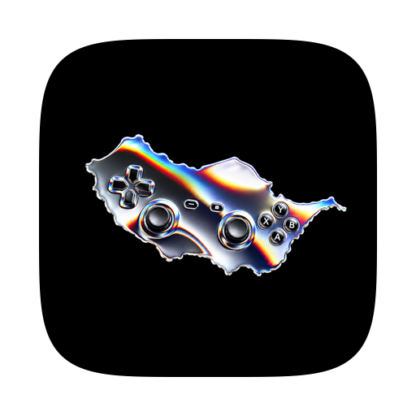
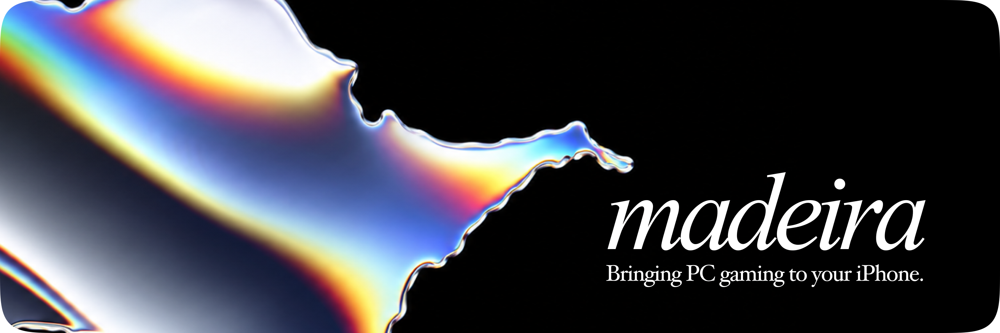

<div align="center">



# Madeira

**Windows PC games on iPhone and iPad, with no jailbreak**


</div>

---

## Overview

This is my fork of [willfaust/Madeira](https://github.com/willfaust/Madeira), which runs
unmodified Windows games inside a single iOS app. The fork tracks upstream and adds Epic Games,
iPad support, a SteamOS-style interface, a rebuilt touch-control editor, and a batch of runtime
fixes that get more games past startup.

## What this fork adds

| Area | Changes |
|---|---|
| **Epic Games** | In-app sign-in, your owned library with catalog titles and artwork, and a native installer ported from [Legendary](https://github.com/derrod/legendary): manifests, chunked downloads with resume and pause, CDN fallback, uninstall, and launching with an exchange code |
| **One library** | Steam, Epic and added games together, split into Installed and Not installed, with store filters, install sizes and free space shown before you download, and a disk cache for artwork |
| **Interface** | SteamOS-style layout built from native glass parts: a collapsible frosted side menu, store-style game pages, a grouped in-game menu, and swipe-to-log-out accounts |
| **iPad** | Runs on iPadOS 26: no `pipe2`, a FEX band that fits the iPad's address space, and 32-bit DXMT built for Metal 3.1, so Half-Life 2 and Portal 2 work |
| **Touch controls** | Rebuilt editor with a docked inspector, snapping, undo and a drawn keyboard; WASD, arrow-key and platformer presets; a mouse-look pad; one global on-screen layout with working opacity |
| **Controllers and input** | Controller slot 0 always present for games that check once at startup, touches mapped into windowed games, keyboard input that finds the game window, and pointer lock for mouse look in Dock sessions |
| **Runtime** | Store emulation on JIT-alias pages (page-straddling stores, exclusives, LSE and misaligned atomics), late JIT alias registration, a `windows.gaming.input` deadlock fix, Wine Mono for .NET games, OpenGL through Mesa Zink and MoltenVK, and missing apiset DLLs |
| **Quality of life** | Quit closes the game's windows, with a fallback to close Madeira; screen-shaped display modes; a JIT progress overlay; and the game's console window captured into its log |

Everything upstream does is still here: Steam sign-in, downloads and Cloud saves, Madeira Dock
(Valve's Windows Steam client), Bluetooth controllers, keyboard, mouse and trackpad, and video
and audio for cutscenes.

## How it works

| Layer | What it does |
|---|---|
| **[FEX-Emu](https://github.com/FEX-Emu/FEX)** | Translates the game's x86 and x86-64 code to ARM64 as it runs |
| **[Wine](https://www.winehq.org/)** | Provides Windows, built for ARM64EC so only the game's own code is translated; 32-bit games run through WoW64 |
| **[DXMT](https://github.com/3Shain/DXMT)** | Draws Direct3D 9, 10 and 11 with Metal |
| **[madeira-d3d12](madeira-d3d12)** | Direct3D 12 on Metal, converting DXIL shaders with Apple's Metal Shader Converter |

iOS apps can't start other programs, so everything runs in one process, Wine's server included.

## Installing

| | |
|---|---|
| **Device** | iPhone on iOS 26 or later, or iPad on iPadOS 26 |
| **JIT** | Needs a debugger attached; [StikDebug](https://github.com/StikDebug/StikDebug) or the built-in setup ([JIT setup](docs/JIT.md)) |
| **Signing** | Any Apple ID; free accounts need re-signing every 7 days, and games and saves survive reinstalls |

1. Download the IPA from the [latest release](https://github.com/iediot/Madeira/releases).
2. Sideload it with SideStore, AltStore, Sideloadly, Plume or similar.
3. Open Madeira, enable JIT, and sign in to Steam or Epic under **Accounts**.

## Building

```sh
git clone --recurse-submodules https://github.com/iediot/Madeira.git
```

The submodules point at Madeira's own forks of FEX, Wine, DXMT and Madeira Dock. This fork's
changes to FEX and DXMT live in [`patches/`](patches). The full walkthrough is in
[`docs/BUILDING.md`](docs/BUILDING.md).

| Path | Contents |
|---|---|
| [`app/`](app) | The iOS app: SwiftUI front end, Wine bridge, Steam and Epic clients |
| [`build/`](build) | Build scripts and iOS-side sources, one folder per component |
| [`patches/`](patches) | This fork's FEX and DXMT changes |
| [`tests/`](tests) | Host checks and x86, x86-64 and DXMT test programs |
| [`docs/`](docs) | [Library](docs/LIBRARY.md), [Epic](docs/EPIC.md), [Steam](docs/STEAM_LIBRARY.md), [controllers](docs/CONTROLLERS.md), [keyboard and mouse](docs/KEYBOARD_MOUSE.md), [WoW64](docs/WOW64.md) and more |

## Credits

Madeira was created by **Will Faust** ([@willfaust](https://github.com/willfaust)), with
**[@125hz](https://github.com/125hz)**, **[@Jfishin](https://github.com/Jfishin)**,
**[@JesseLovelace](https://github.com/JesseLovelace)**, **[@danperks](https://github.com/danperks)**,
**[@bahacan16](https://github.com/bahacan16)** and **[@spitefulowl](https://github.com/spitefulowl)**.
This fork also carries fixes from the forks of llucasandersen, x3gamer10, vcvkk, c-gow and
dre4moff.

Built on [Wine](https://www.winehq.org/), [FEX-Emu](https://github.com/FEX-Emu/FEX),
[DXMT](https://github.com/3Shain/DXMT), [rpmalloc](https://github.com/mjansson/rpmalloc),
[Legendary](https://github.com/derrod/legendary) and [StikDebug](https://github.com/StikDebug/StikDebug).

## License

GPL-3.0-or-later ([`LICENSE`](LICENSE)) with the Madeira Converter Exception
([`LICENSE-EXCEPTION.md`](LICENSE-EXCEPTION.md)). Component licenses are in
[`docs/LICENSING.md`](docs/LICENSING.md) and [`THIRD-PARTY-NOTICES.md`](THIRD-PARTY-NOTICES.md).
Microsoft's Visual C++ runtime is not included.

<p align="center">
  
</p>
